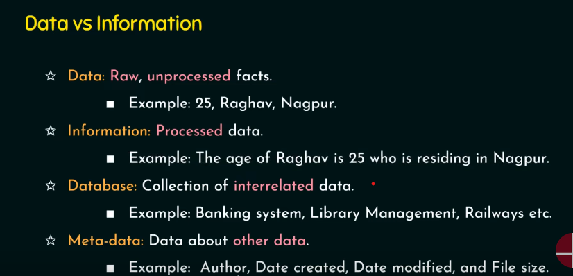

# DBMS

A **Database Management System (DBMS)** is essentially a computerized data-keeping system that provides users with facilities to perform various operations on the data and the structure of a database.

## Table of Contents

1. [Introduction to RDBMS](#1-introduction-to-rdbms)
2. [Relational Database](#2-relational-database)
3. [Database Design and the E-R Model](#3-database-design-and-the-e-r-model)
4. [Introduction to SQL](#4-introduction-to-sql)
5. [Advanced SQL](#5-advanced-sql)
6. [Formal Relational Query Languages](#6-formal-relational-query-languages)
7. [Normalization and Normal Forms](#7-normalization-and-normal-forms)
8. [Storage and File Structure](#8-storage-and-file-structure)
9. [Indexing and Hashing](#9-indexing-and-hashing)
10. [Query Processing & Query Optimization](#10-query-processing--query-optimization)
11. [Transactions and Concurrency Control](#11-transactions-and-concurrency-control)
12. [Database System Architectures](#12-database-system-architectures)
13. [Data Warehousing and Mining](#13-data-warehousing-and-mining)
14. [XML and Advanced Databases](#14-xml-and-advanced-databases)

**Definition**: A DBMS is a collection of interrelated data and a set of programs to access that data.

**Primary Goals**:

- Store and retrieve data.
- Provide convenient and efficient data access.
- Manage large volumes of information.
- Define data storage structures.
- Offer mechanisms for data manipulation.
- Ensure the safety of information stored.

### Data vs Information

---

## Applications of DBMS

1. **Sales:**

   - _Notes:_ DBMS is used in sales to manage customer information, sales transactions, inventory, and sales reports.
   - _Example:_ A retail store uses a DBMS to track product sales, customer profiles, and inventory levels, enabling efficient restocking and targeted marketing.

2. **Finance:**

   - _Notes:_ In finance, DBMS helps manage financial data, investments, asset allocation, and regulatory compliance.
   - _Example:_ An investment bank uses a DBMS to track stocks, bonds, and customer portfolios, facilitating real-time financial analysis.

3. **Banking:**

   - _Notes:_ DBMS in banking is essential for customer accounts, transactions, loan management, and fraud detection.
   - _Example:_ A commercial bank employs a DBMS to store account details, process transactions, and monitor for suspicious activities.

4. **Schools/Colleges/Universities:**

   - _Notes:_ Educational institutions use DBMS for student records, course schedules, grading, and faculty information.
   - _Example:_ A university's DBMS manages student enrollments, course registration, and academic records.

5. **Manufacturing:**

   - _Notes:_ DBMS is used in manufacturing to control inventory, production schedules, quality control, and supply chain management.
   - _Example:_ A car manufacturing company uses a DBMS to optimize production schedules, track raw materials, and ensure product quality.

6. **Online Stores:**

   - _Notes:_ E-commerce sites rely on DBMS for product listings, customer accounts, order processing, and personalized recommendations.
   - _Example:_ An online clothing store utilizes a DBMS to manage a vast inventory of clothing items, process orders, and offer tailored product suggestions to customers.

7. **Railway Reservations:**

   - _Notes:_ DBMS aids in handling train schedules, ticket booking, passenger records, and seat availability.
   - _Example:_ A national railway system uses a DBMS to manage train routes, sell tickets, and keep track of passenger reservations.

8. **Airlines:**

   - _Notes:_ Airlines use DBMS for booking flights, managing flight schedules, passenger information, and cargo logistics.
   - _Example:_ An international airline relies on a DBMS to coordinate flight schedules, track passenger details, and ensure efficient cargo handling.

9. **HR (Human Resources):**

   - _Notes:_ HR departments use DBMS to manage employee records, payroll, recruitment, and performance evaluations.
   - _Example:_ A large corporation employs a DBMS to store employee information, process payroll, and facilitate the recruitment and onboarding of new staff.

10. **Telecom:**

    - _Notes:_ Telecom companies utilize DBMS to store customer profiles, billing information, call records, and network performance data.
    - _Example:_ A telecommunications provider uses a DBMS to manage customer subscriptions, track call usage, and optimize network performance.

11. **Insurance:**
    - _Notes:_ In the insurance sector, DBMS is crucial for policy management, claims processing, risk assessment, and customer service.
    - _Example:_ An insurance company relies on a DBMS to store policyholder data, handle claims, assess risk factors, and deliver customer support.

DBMS plays a vital role in various industries, providing efficient data management and retrieval capabilities, enhancing decision-making processes, and ensuring data security and integrity.

---
