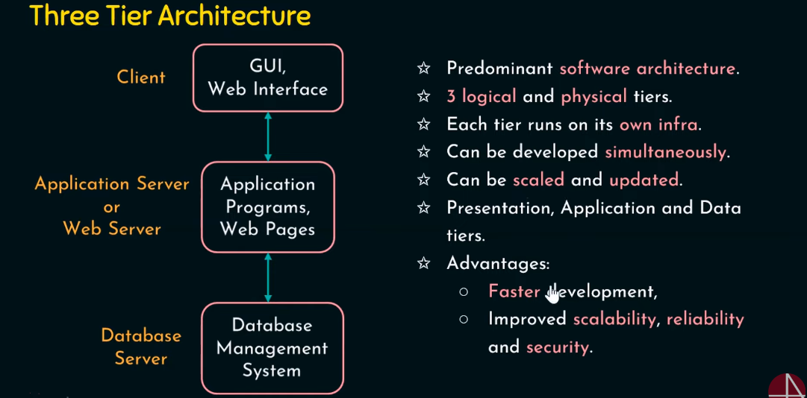

# DBMS

A **Database Management System (DBMS)** is essentially a computerized data-keeping system that provides users with facilities to perform various operations on the data and the structure of a database.

## Table of Contents

---

**Definition**: A DBMS is a collection of interrelated data and a set of programs to access that data.

**Primary Goals**:

- Store and retrieve data.
- Provide convenient and efficient data access.
- Manage large volumes of information.
- Define data storage structures.
- Offer mechanisms for data manipulation.
- Ensure the safety of information stored.

### Data vs Information

---

## Applications of DBMS

1. **Sales:**

   - _Notes:_ DBMS is used in sales to manage customer information, sales transactions, inventory, and sales reports.
   - _Example:_ A retail store uses a DBMS to track product sales, customer profiles, and inventory levels, enabling efficient restocking and targeted marketing.

2. **Finance:**

   - _Notes:_ In finance, DBMS helps manage financial data, investments, asset allocation, and regulatory compliance.
   - _Example:_ An investment bank uses a DBMS to track stocks, bonds, and customer portfolios, facilitating real-time financial analysis.

3. **Banking:**

   - _Notes:_ DBMS in banking is essential for customer accounts, transactions, loan management, and fraud detection.
   - _Example:_ A commercial bank employs a DBMS to store account details, process transactions, and monitor for suspicious activities.

4. **Schools/Colleges/Universities:**

   - _Notes:_ Educational institutions use DBMS for student records, course schedules, grading, and faculty information.
   - _Example:_ A university's DBMS manages student enrollments, course registration, and academic records.

5. **Manufacturing:**

   - _Notes:_ DBMS is used in manufacturing to control inventory, production schedules, quality control, and supply chain management.
   - _Example:_ A car manufacturing company uses a DBMS to optimize production schedules, track raw materials, and ensure product quality.

6. **Online Stores:**

   - _Notes:_ E-commerce sites rely on DBMS for product listings, customer accounts, order processing, and personalized recommendations.
   - _Example:_ An online clothing store utilizes a DBMS to manage a vast inventory of clothing items, process orders, and offer tailored product suggestions to customers.

7. **Railway Reservations:**

   - _Notes:_ DBMS aids in handling train schedules, ticket booking, passenger records, and seat availability.
   - _Example:_ A national railway system uses a DBMS to manage train routes, sell tickets, and keep track of passenger reservations.

8. **Airlines:**

   - _Notes:_ Airlines use DBMS for booking flights, managing flight schedules, passenger information, and cargo logistics.
   - _Example:_ An international airline relies on a DBMS to coordinate flight schedules, track passenger details, and ensure efficient cargo handling.

9. **HR (Human Resources):**

   - _Notes:_ HR departments use DBMS to manage employee records, payroll, recruitment, and performance evaluations.
   - _Example:_ A large corporation employs a DBMS to store employee information, process payroll, and facilitate the recruitment and onboarding of new staff.

10. **Telecom:**

    - _Notes:_ Telecom companies utilize DBMS to store customer profiles, billing information, call records, and network performance data.
    - _Example:_ A telecommunications provider uses a DBMS to manage customer subscriptions, track call usage, and optimize network performance.

11. **Insurance:**
    - _Notes:_ In the insurance sector, DBMS is crucial for policy management, claims processing, risk assessment, and customer service.
    - _Example:_ An insurance company relies on a DBMS to store policyholder data, handle claims, assess risk factors, and deliver customer support.

DBMS plays a vital role in various industries, providing efficient data management and retrieval capabilities, enhancing decision-making processes, and ensuring data security and integrity.

---

## File System vs. DBMS

### Data Redundancy and Inconsistency

- In a **file system**, different programmers may create files with varying structures and in different programming languages, leading to data duplication and redundancy.
- This redundancy results in higher storage and access costs, as well as data inconsistency, as changes to data may not be reflected across all relevant files.

### Difficulty in Accessing the Data

- **File systems** are not convenient and efficient for data retrieval, requiring more responsive systems to efficiently access and manage data.

### Data Isolation

- Achieving **data isolation** in a file system can be challenging, as related data may be stored in different file locations, making it harder to maintain data integrity.

### Integrity Problems

- File systems lack built-in mechanisms to enforce **consistency constraints**. For example, ensuring that an account balance should never be zero is easier to implement in software code but not as easily enforced in files.
- When new constraints are introduced, it can be problematic, especially when these constraints involve data items from different files, compounding the issue.

### Atomicity Problems

- In any system, failures can occur, and data restoration may be necessary. **Atomicity**, the principle of "All or None," is challenging to ensure in a file system.
- For example, in a fund transfer operation, it's crucial that either both the debit and credit operations occur, or neither occurs. Achieving this level of atomicity is complex in a file system.

### Concurrent Access Anomalies

- **Concurrency** is generally a good thing as it allows multiple users to access data simultaneously. However, in a file system, concurrent access can lead to data inconsistency and anomalies.

### Security Problems

- **Security problems** in file systems encompass issues related to data access, authentication, and authorization. Controlling and managing access to data can be cumbersome and less secure compared to a DBMS.

In summary, a Database Management System (DBMS) is a superior choice over a file system due to its ability to reduce data redundancy, improve data consistency, provide efficient data retrieval, enforce data integrity, ensure atomicity, handle concurrent access, and enhance security measures, making it a more robust solution for managing and accessing data.

---

## Three-Tier Architecture in DBMS

Three-tier architecture, also known as multi-tier architecture, is a popular design pattern used in Database Management Systems (DBMS) and application development. It divides the system into three interconnected tiers or layers, each with distinct functions. This architecture offers several advantages, including scalability, flexibility, and improved maintainability. The three tiers are as follows:

### 1. **Presentation Tier (User Interface)**

- The **presentation tier**, also known as the **user interface (UI)** tier, is the topmost layer and is where users interact with the system. It is responsible for displaying data to users and capturing their input.

- **Functions**:

  - User interface design, including forms, screens, and reports.
  - Handling user input and presenting results.
  - Managing user authentication and authorization.

- **Examples**:
  - Web browsers, mobile app interfaces, desktop application interfaces.

### 2. **Application Tier (Logic Tier)**

- The **application tier**, also called the **logic tier**, is the middle layer that processes and manages business logic and application functionality. It acts as an intermediary between the presentation tier and the data tier.

- **Functions**:

  - Implementing business logic, algorithms, and application rules.
  - Handling user requests and interactions.
  - Communicating with the data tier to retrieve or update data.

- **Examples**:
  - Application servers, web servers, middleware components, server-side scripts.

### 3. **Data Tier (Database Tier)**

- The **data tier**, also referred to as the **database tier**, is the lowest layer responsible for storing and managing data. It focuses on data storage, retrieval, and database management.

- **Functions**:

  - Storing and organizing data in a database management system (DBMS).
  - Managing data access, security, and transactions.
  - Providing data to the application tier upon request.

- **Examples**:
  - Database management systems such as MySQL, Oracle, Microsoft SQL Server.

### Key Advantages of Three-Tier Architecture:

- **Scalability**: Each tier can be scaled independently to handle increasing loads, improving system performance.

- **Flexibility**: Changes in one tier do not necessarily affect the others, promoting flexibility in system development and maintenance.

- **Security**: Security measures can be implemented at each tier, enhancing data protection and access control.

- **Maintainability**: Separation of concerns makes it easier to maintain and update specific components of the system.

- **Improved Performance**: By distributing processing across tiers, the system can achieve better performance and responsiveness.

Three-tier architecture is widely used in modern application development and is the foundation for building robust and efficient DBMS-based systems. It helps organize code and functionality, enhances system reliability, and facilitates collaboration among developers working on different aspects of a project.
