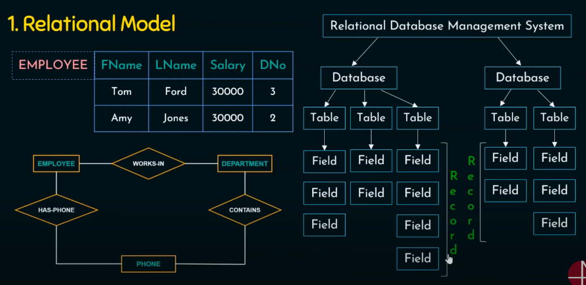
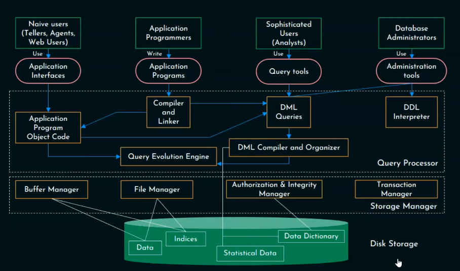

# DBMS

A **Database Management System (DBMS)** is essentially a computerized data-keeping system that provides users with facilities to perform various operations on the data and the structure of a database.

# Table of Contents (top)

## Applications of DBMS

## File System vs. DBMS

## Three-Tier Architecture in DBMS

## View of data

---

**Definition**: A DBMS is a collection of interrelated data and a set of programs to access that data.

**Primary Goals**:

- Store and retrieve data.
- Provide convenient and efficient data access.
- Manage large volumes of information.
- Define data storage structures.
- Offer mechanisms for data manipulation.
- Ensure the safety of information stored.

### Data vs Information


---

## Applications of DBMS

1. **Sales:**

   - _Notes:_ DBMS is used in sales to manage customer information, sales transactions, inventory, and sales reports.
   - _Example:_ A retail store uses a DBMS to track product sales, customer profiles, and inventory levels, enabling efficient restocking and targeted marketing.

2. **Finance:**

   - _Notes:_ In finance, DBMS helps manage financial data, investments, asset allocation, and regulatory compliance.
   - _Example:_ An investment bank uses a DBMS to track stocks, bonds, and customer portfolios, facilitating real-time financial analysis.

3. **Banking:**

   - _Notes:_ DBMS in banking is essential for customer accounts, transactions, loan management, and fraud detection.
   - _Example:_ A commercial bank employs a DBMS to store account details, process transactions, and monitor for suspicious activities.

4. **Schools/Colleges/Universities:**

   - _Notes:_ Educational institutions use DBMS for student records, course schedules, grading, and faculty information.
   - _Example:_ A university's DBMS manages student enrollments, course registration, and academic records.

5. **Manufacturing:**

   - _Notes:_ DBMS is used in manufacturing to control inventory, production schedules, quality control, and supply chain management.
   - _Example:_ A car manufacturing company uses a DBMS to optimize production schedules, track raw materials, and ensure product quality.

6. **Online Stores:**

   - _Notes:_ E-commerce sites rely on DBMS for product listings, customer accounts, order processing, and personalized recommendations.
   - _Example:_ An online clothing store utilizes a DBMS to manage a vast inventory of clothing items, process orders, and offer tailored product suggestions to customers.

7. **Railway Reservations:**

   - _Notes:_ DBMS aids in handling train schedules, ticket booking, passenger records, and seat availability.
   - _Example:_ A national railway system uses a DBMS to manage train routes, sell tickets, and keep track of passenger reservations.

8. **Airlines:**

   - _Notes:_ Airlines use DBMS for booking flights, managing flight schedules, passenger information, and cargo logistics.
   - _Example:_ An international airline relies on a DBMS to coordinate flight schedules, track passenger details, and ensure efficient cargo handling.

9. **HR (Human Resources):**

   - _Notes:_ HR departments use DBMS to manage employee records, payroll, recruitment, and performance evaluations.
   - _Example:_ A large corporation employs a DBMS to store employee information, process payroll, and facilitate the recruitment and onboarding of new staff.

10. **Telecom:**

    - _Notes:_ Telecom companies utilize DBMS to store customer profiles, billing information, call records, and network performance data.
    - _Example:_ A telecommunications provider uses a DBMS to manage customer subscriptions, track call usage, and optimize network performance.

11. **Insurance:**
    - _Notes:_ In the insurance sector, DBMS is crucial for policy management, claims processing, risk assessment, and customer service.
    - _Example:_ An insurance company relies on a DBMS to store policyholder data, handle claims, assess risk factors, and deliver customer support.

DBMS plays a vital role in various industries, providing efficient data management and retrieval capabilities, enhancing decision-making processes, and ensuring data security and integrity.

---

## File System vs. DBMS

### Data Redundancy and Inconsistency

- In a **file system**, different programmers may create files with varying structures and in different programming languages, leading to data duplication and redundancy.
- This redundancy results in higher storage and access costs, as well as data inconsistency, as changes to data may not be reflected across all relevant files.

### Difficulty in Accessing the Data

- **File systems** are not convenient and efficient for data retrieval, requiring more responsive systems to efficiently access and manage data.

### Data Isolation

- Achieving **data isolation** in a file system can be challenging, as related data may be stored in different file locations, making it harder to maintain data integrity.

### Integrity Problems

- File systems lack built-in mechanisms to enforce **consistency constraints**. For example, ensuring that an account balance should never be zero is easier to implement in software code but not as easily enforced in files.
- When new constraints are introduced, it can be problematic, especially when these constraints involve data items from different files, compounding the issue.

### Atomicity Problems

- In any system, failures can occur, and data restoration may be necessary. **Atomicity**, the principle of "All or None," is challenging to ensure in a file system.
- For example, in a fund transfer operation, it's crucial that either both the debit and credit operations occur, or neither occurs. Achieving this level of atomicity is complex in a file system.

### Concurrent Access Anomalies

- **Concurrency** is generally a good thing as it allows multiple users to access data simultaneously. However, in a file system, concurrent access can lead to data inconsistency and anomalies.

### Security Problems

- **Security problems** in file systems encompass issues related to data access, authentication, and authorization. Controlling and managing access to data can be cumbersome and less secure compared to a DBMS.

In summary, a Database Management System (DBMS) is a superior choice over a file system due to its ability to reduce data redundancy, improve data consistency, provide efficient data retrieval, enforce data integrity, ensure atomicity, handle concurrent access, and enhance security measures, making it a more robust solution for managing and accessing data.

---

## Three-Tier Architecture in DBMS


Three-tier architecture, also known as multi-tier architecture, is a popular design pattern used in Database Management Systems (DBMS) and application development. It divides the system into three interconnected tiers or layers, each with distinct functions. This architecture offers several advantages, including scalability, flexibility, and improved maintainability. The three tiers are as follows:

### 1. **Presentation Tier (User Interface)**

- The **presentation tier**, also known as the **user interface (UI)** tier, is the topmost layer and is where users interact with the system. It is responsible for displaying data to users and capturing their input.

- **Functions**:

  - User interface design, including forms, screens, and reports.
  - Handling user input and presenting results.
  - Managing user authentication and authorization.

- **Examples**:
  - Web browsers, mobile app interfaces, desktop application interfaces.

### 2. **Application Tier (Logic Tier)**

- The **application tier**, also called the **logic tier**, is the middle layer that processes and manages business logic and application functionality. It acts as an intermediary between the presentation tier and the data tier.

- **Functions**:

  - Implementing business logic, algorithms, and application rules.
  - Handling user requests and interactions.
  - Communicating with the data tier to retrieve or update data.

- **Examples**:
  - Application servers, web servers, middleware components, server-side scripts.

### 3. **Data Tier (Database Tier)**

- The **data tier**, also referred to as the **database tier**, is the lowest layer responsible for storing and managing data. It focuses on data storage, retrieval, and database management.

- **Functions**:

  - Storing and organizing data in a database management system (DBMS).
  - Managing data access, security, and transactions.
  - Providing data to the application tier upon request.

- **Examples**:
  - Database management systems such as MySQL, Oracle, Microsoft SQL Server.

### Key Advantages of Three-Tier Architecture:

- **Scalability**: Each tier can be scaled independently to handle increasing loads, improving system performance.

- **Flexibility**: Changes in one tier do not necessarily affect the others, promoting flexibility in system development and maintenance.

- **Security**: Security measures can be implemented at each tier, enhancing data protection and access control.

- **Maintainability**: Separation of concerns makes it easier to maintain and update specific components of the system.

- **Improved Performance**: By distributing processing across tiers, the system can achieve better performance and responsiveness.

Three-tier architecture is widely used in modern application development and is the foundation for building robust and efficient DBMS-based systems. It helps organize code and functionality, enhances system reliability, and facilitates collaboration among developers working on different aspects of a project.


---

## View of data


## [reference vid](https://www.youtube.com/watch?v=I_PrZ1NHZr8&list=PLBlnK6fEyqRiyryTrbKHX1Sh9luYI0dhX&index=6)

---

## Instances and Schemas in DBMS

### Schemas

- **Schema** refers to the overall design or structure of a database. It represents the blueprint of the database, defining how data is organized and the relationships between data elements.

- In essence, a **database schema** can be thought of as the "variable declaration" or "type definitions" for the database. It specifies the structure, data types, constraints, and rules that will be applied to the data stored in the database.

- Schemas are relatively stable and do not undergo frequent changes. Once established, they provide a stable framework for the database.

**Example**:

```sql
-- Define a schema for a Student table
CREATE TABLE Student (
  Rollno numeric(5),
  Name char(25),
  Class char(25)
);
```

In this example, the database schema defines the structure of the "Student" table, specifying the data types for each field (Rollno, Name, and Class).

### Instances

- **Instances** are the actual collections of data stored in the database at a particular moment in time. An instance represents the real data that has been added, modified, or deleted within the database.

- Unlike schemas, database instances are subject to frequent changes. As users interact with the database, data values are inserted, updated, or removed, resulting in changes to the instance.

- Think of a database instance as the "value of the variable" that adheres to the schema's structure and rules. It is the dynamic, evolving aspect of the database.

**Example**:

```sql
-- Database Instance (Student table)
| Rollno | Name         | Class      |
|-------|--------------|------------|
| 101   | John Smith   | Biology    |
| 102   | Sarah Brown  | Chemistry  |
| 103   | Michael Lee  | Physics    |
```

In this example, the database instance represents the current data within the "Student" table, which may change as new students are added or existing ones are updated or removed.

In summary, database schemas define the structure and rules for a database, serving as a blueprint for data organization, while instances represent the actual data stored in the database, subject to frequent changes and updates. The clear separation between schemas and instances is fundamental in database management, ensuring data consistency and integrity while allowing flexibility in data manipulation.


---


## Database Administrator

Certainly! Here's an explanation of the role of a Database Administrator (DBA) along with an elaboration of their responsibilities:

## Database Administrator (DBA)

A Database Administrator (DBA) is a crucial role in the field of database management. DBAs are responsible for the efficient and secure operation of database systems within an organization. They play a vital role in ensuring that data is available, accessible, and maintained in a consistent and secure manner. The responsibilities of a DBA are extensive and diverse, and they are essential for the smooth functioning of an organization's data infrastructure.

### **Elaboration of the DBA's Role and Responsibilities:**

1. **Database Installation and Configuration:**

   - DBAs are responsible for setting up database management systems, configuring them for optimal performance, and ensuring that hardware and software components are compatible.

2. **Database Design and Schema Management:**

   - DBAs work with application developers and data architects to design the structure of databases, including table schemas, relationships, and data integrity constraints.

3. **Data Backup and Recovery:**

   - DBAs establish backup and recovery procedures to safeguard data against loss or corruption. They regularly back up the database and test recovery processes.

4. **Database Security:**

   - Ensuring data security is a primary responsibility. DBAs implement access controls, authentication, and authorization mechanisms to protect sensitive data from unauthorized access or breaches.

5. **Performance Monitoring and Optimization:**

   - DBAs continuously monitor database performance, identifying and resolving bottlenecks, optimizing queries, and fine-tuning database configurations for better efficiency.

6. **Data Migration and ETL (Extract, Transform, Load):**

   - When data needs to be moved between systems or transformed for different purposes, DBAs are responsible for data migration and ETL processes.

7. **Patch Management and Upgrades:**

   - DBAs apply patches, updates, and software upgrades to the database management system to fix bugs, enhance security, and introduce new features.

8. **Data Maintenance and Data Cleaning:**

   - DBAs oversee data maintenance tasks, including data purging, archiving, and data cleaning to ensure data quality and minimize redundancy.

9. **Disaster Recovery Planning:**

   - DBAs develop and maintain disaster recovery plans, including strategies for data restoration and system recovery in case of unexpected events like system failures or natural disasters.

10. **Compliance and Auditing:**

    - Ensuring that the organization complies with industry regulations and standards related to data management is another crucial responsibility. DBAs may be involved in data audits and compliance reporting.

11. **Database Documentation:**

    - DBAs maintain comprehensive documentation of the database schema, configurations, and procedures, which is essential for troubleshooting and knowledge transfer.

12. **User Support and Training:**

    - DBAs provide support to end-users and other IT teams, helping them resolve database-related issues and offering training on database usage and best practices.

13. **Capacity Planning:**

    - DBAs assess the future data storage and performance needs of the organization and plan for necessary expansions or upgrades.

14. **Automation and Scripting:**
    - DBAs often automate routine tasks and create scripts to streamline database management processes, saving time and reducing the risk of human error.

In summary, a Database Administrator (DBA) plays a pivotal role in ensuring the reliability, security, and performance of an organization's databases. Their responsibilities encompass database design, security, performance optimization, data management, disaster recovery, and compliance, making them indispensable for effective data management and information technology operations within an organization.

---


## Relational Model

The Relational Model is a data model used to organize and manage data in a structured and efficient manner. It was introduced by Edgar F. Codd in 1970 and has since become the foundation for most modern database systems, including popular Relational Database Management Systems (RDBMS) like MySQL, PostgreSQL, Oracle, and Microsoft SQL Server.

**Key Characteristics of the Relational Model:**

1. **Collection of Tables:**

   - In the relational model, data is organized into tables. These tables are often referred to as relations, and each relation represents a specific entity or concept in the database.

2. **Tables Represent Data and Relationships:**

   - Tables in the relational model not only store data but also represent the relationships between data entities. These relationships are established using keys and foreign keys, ensuring data integrity and consistency.

3. **Multiple Columns with Unique Names:**

   - Each table comprises multiple columns, with each column having a unique name that identifies the attribute it represents. Columns are also known as fields or attributes.

4. **Tables = Relations:**

   - In the relational model, tables are often referred to as relations, which is where the model gets its name. The term "relation" is used to describe a two-dimensional structure where data is organized in rows and columns.

5. **Record-Based Model:**

   - The relational model is record-based, meaning it stores data in individual records or rows. Each row represents a specific instance or entry of the entity being modeled.

6. **Fixed Format Records of Several Types:**

   - Each record in a table adheres to a fixed format, meaning that it has a specific number of fields (attributes), each with a defined data type. This structure enforces data consistency and integrity.

7. **Most Widely Used Data Model:**

   - The relational model is the most widely used data model in database management due to its simplicity, efficiency, and the use of Structured Query Language (SQL) as a standardized language for querying and manipulating data.

8. **Current DBMS are Based on Relational Model:**
   - Most modern Database Management Systems (DBMS), which are software systems used to create, manage, and query databases, are based on the relational model. These systems provide tools for designing, implementing, and interacting with relational databases.

The Relational Model offers several advantages, including data organization, flexibility, and the ability to express complex queries using SQL. It promotes data integrity and supports normalized data structures, reducing redundancy and improving data consistency. This model has remained the foundation for data management in various domains, from business applications to scientific research, and continues to evolve with the integration of advanced features in modern RDBMS.

Certainly! Let's elaborate on the Entity-Relationship Model (ER Model) in the context of database design:



## Entity-Relationship Model

The Entity-Relationship Model (ER Model) is a widely used approach in database design to represent and visualize the structure and relationships within a database. This model helps database designers and developers understand how data is organized and connected in a database system. It's particularly useful in the early stages of database design when conceptualizing the structure of the database.

**Key Characteristics of the Entity-Relationship Model:**

1. **Collection of Basic Objects - Entities and Relationships:**

   - The ER Model is built upon two primary components: entities and relationships. Entities are the fundamental building blocks of the model, while relationships describe how these entities are related to one another.

2. **An Entity Represents a Real-World Object:**

   - An entity in the ER Model is a representation of a real-world object, concept, or thing. It can be a person, place, event, concept, or any distinguishable item with characteristics that need to be stored in the database.

3. **Distinguishable from Other Objects:**

   - To be included as an entity, an object must be distinguishable from other objects. In other words, it should have unique attributes that allow it to be uniquely identified within the scope of the database.

4. **Widely Used in Database Design:**
   - The Entity-Relationship Model is widely used in database design as it provides a visual and conceptual framework for designing database schemas. It allows designers to create diagrams that represent the database structure and its relationships, making it easier to understand, communicate, and implement the database design.

**Entities in the ER Model:**

- Entities are depicted as rectangles in ER diagrams and represent objects or concepts that are of interest to the organization or system being modeled. Each entity is associated with a set of attributes that describe its characteristics. For example, in a university database, "Student" could be an entity with attributes like "StudentID," "Name," and "DateOfBirth."

**Relationships in the ER Model:**

- Relationships in the ER Model are represented as lines connecting entities. These lines indicate how entities are related to each other. Relationships have associated properties, such as cardinality (the number of instances of one entity related to another) and participation (whether entities are required or optional in the relationship). For example, a "Enrolls In" relationship may connect the "Student" entity with the "Course" entity, indicating that students can enroll in multiple courses.

The Entity-Relationship Model serves as a valuable tool for capturing the essence of a problem domain or business process and transforming it into a structured database schema. It simplifies the process of designing databases by providing a clear and intuitive way to visualize the data and its relationships. This model is often used in combination with Entity-Relationship Diagrams (ERDs), which are graphical representations of the ER Model, to communicate database designs effectively among project stakeholders.


## Object-Based Model

The Object-Based Model is a data modeling approach that combines elements of traditional data models with features inspired by Object-Oriented Programming (OOP). It is used to represent data and their relationships, particularly in databases that are designed to work with object-oriented programming languages like C++, Java, C#, and others.

**Key Characteristics of the Object-Based Model:**

1. **Relationship with Object-Oriented Programming (OOP):**

   - The Object-Based Model is closely tied to OOP languages. It borrows principles and concepts from OOP to represent data in a manner that is more intuitive for developers using these languages.

2. **Need for an Object-Oriented Data Model:**

   - The need for an object-oriented data model arises from the desire to bridge the gap between traditional relational database management systems (RDBMS) and object-oriented programming languages. These languages use objects as their fundamental building blocks, while RDBMS uses tables.

3. **Object-Based Model = E-R Model + OO Features:**

   - The Object-Based Model can be seen as an extension of the Entity-Relationship (E-R) Model with object-oriented features. It combines the structure and relationships of the E-R model with the encapsulation, inheritance, and polymorphism features of object-oriented programming.

4. **Object-Relational Data Model = Object-Based Model + Relational Model:**
   - The Object-Relational Data Model (ORDBMS) further extends the Object-Based Model by combining it with the traditional Relational Model. ORDBMS systems allow for the storage of complex data types, user-defined types, and methods/functions within the database. They support object-oriented features alongside traditional relational operations.

**Object-Based Model Features:**

- **Objects:** In the Object-Based Model, data is represented as objects. These objects encapsulate both data and the methods or operations that can be performed on that data. Objects can inherit attributes and methods from other objects, promoting code reuse and modularity.

- **Encapsulation:** Encapsulation is a fundamental OOP concept where an object's internal state is hidden from the outside world, and access to its data is controlled through methods or functions.

- **Inheritance:** Inheritance allows objects to inherit attributes and methods from other objects. This promotes code reuse and the creation of hierarchies of objects.

- **Polymorphism:** Polymorphism enables different objects to respond to the same method call in a manner that is appropriate for their specific class. It enhances flexibility and extensibility in data manipulation.

- **Complex Data Types:** The Object-Based Model often supports complex data types such as arrays, structures, and user-defined data types. This is in contrast to traditional relational databases that primarily work with simple data types.

The Object-Based Model is beneficial when dealing with complex data structures, complex relationships, or when a direct mapping between object-oriented programs and a traditional relational database is impractical. Object-Relational Database Management Systems (ORDBMS) extend these concepts further by merging the Object-Based Model with the Relational Model, providing a robust framework for managing complex data while preserving the benefits of the relational database structure. This model is especially useful when the object-oriented nature of the programming language and the complexity of the data need to be preserved in the database.


## Semistructured Data Model

The Semistructured Data Model is a flexible data model that allows for the representation of data with varying structures, making it a suitable choice for scenarios where data does not conform to rigid, well-defined schemas found in traditional relational databases. In this model, data is described using a flexible specification, enabling individual data items to have different sets of attributes.

**Key Characteristics of the Semistructured Data Model:**

1. **Specification of Data:**

   - The Semistructured Data Model allows data to be represented and managed without a strict, predefined schema. Instead, data is described using a flexible specification that can accommodate variations in structure.

2. **Variability in Attributes:**

   - One of the distinctive features of semistructured data is that items of the same type may have different sets of attributes. In other words, data entities do not have to conform to a uniform and fixed schema, which is common in structured data models like the relational model.

3. **Contrast to Previous Data Models:**

   - Semistructured data stands in contrast to the rigid, structured models, such as the Relational Model, where data is organized into tables with fixed attributes and data types. The Semistructured Data Model provides more flexibility to handle data where the structure is not well-defined or frequently changes.

4. **Extensible Markup Language (XML):**
   - One of the most prominent representations of semistructured data is through Extensible Markup Language (XML). XML is a flexible and widely used format for describing, storing, and exchanging semistructured data. It allows for nested and hierarchical data structures and is often used in web-based applications and document storage.

**Semistructured Data vs. Structured Data:**

- In structured data models (e.g., relational databases), data must conform to a predefined schema. Each record in a table has the same set of attributes, and data integrity is strictly enforced.

- In contrast, semistructured data allows for variations in data structures and is more lenient with regard to schema enforcement. This flexibility is especially valuable when dealing with data sources such as documents, web pages, user-generated content, and data that doesn't fit neatly into tabular structures.

**Use Cases:**

Semistructured data is commonly encountered in various scenarios, including:

- **Web Content:** HTML, XML, and JSON are commonly used to represent web content, which often has variable structures.

- **Document Stores:** Document-oriented databases and repositories are designed to store and manage documents with variable structures.

- **User-Generated Content:** Data generated by users on social media, blogs, and forums may have varying attributes and structures.

- **Data Integration:** Semistructured data models are used in data integration scenarios where data from different sources with varying structures needs to be harmonized.

- **Metadata:** Metadata in various domains, such as libraries and multimedia, may be semistructured due to variable attributes.

In summary, the Semistructured Data Model provides a more flexible and accommodating approach to data representation, making it particularly well-suited for scenarios where data doesn't neatly fit into the rigid structures of traditional structured data models. XML is a widely used format for representing semistructured data, and the model is essential for handling a wide range of data sources and integration scenarios.

---

## database architecture



### [videos](https://www.youtube.com/watch?v=8_W5JT7Jz2Y&list=PLBlnK6fEyqRiyryTrbKHX1Sh9luYI0dhX&index=15)


